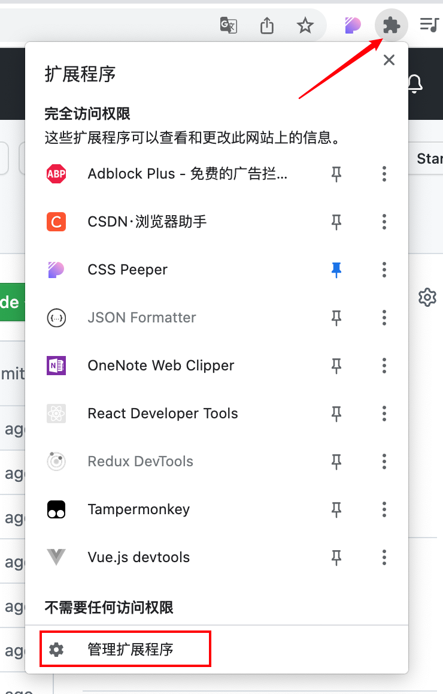
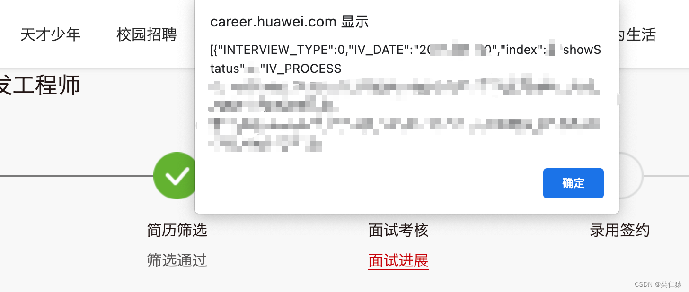

# hw-extensions

## 1、下载

[Release](https://github.com/godwei123/hw-extensions/releases/download/beta/extensions.v0.0.1-beta.zip)  或 源码中 [extensions.zip](https://github.com/godwei123/hw-extensions/blob/main/extensions.zip) 压缩包

## 2、安装

1、打开Google浏览器/Edge浏览器

2、打开管理扩展程序

3、打开开发者模式

4、加载解压后的文件

## 3、使用

1、登录后点击申请进展

2、进入页面后即弹出状态码

